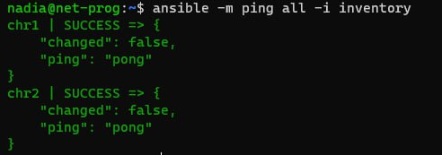
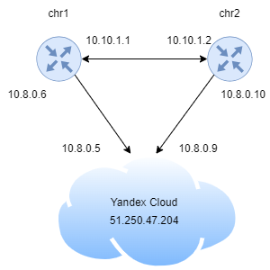
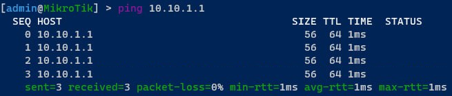
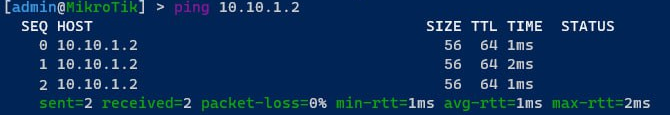

University: [ITMO University](https://itmo.ru/ru/)

Faculty: [FICT](https://fict.itmo.ru)

Course: [Network programming](https://github.com/itmo-ict-faculty/network-programming)

Year: 2023/2024

Group: K34212

Author: Sobolevskaya Nadezhda Sergeevna

Lab: Lab2

Date of create: 01.12.2023

Date of finished: 06.12.2023

# Отчет по лабораторной работе №2: "Развертывание дополнительного CHR, первый сценарий Ansible"

## Цель работы

С помощью Ansible настроить несколько сетевых устройств и собрать информацию о них. Правильно собрать файл Inventory.

## Ход работы


#### 1. Создадим сертификаты для второго роутера
```console
nadia@net-prog:/etc/openvpn/easy-rsa$ sudo ./easyrsa gen-req chr2 nopass
nadia@net-prog:/etc/openvpn/easy-rsa$ sudo ./easyrsa sign-req client chr2
nadia@net-prog:/etc/openvpn/easy-rsa$ sudo cp ./pki/private/chr2.key /etc/openvpn/certs/
nadia@net-prog:/etc/openvpn/easy-rsa$ sudo cp ./pki/issued/chr2.crt /etc/openvpn/certs/
```

#### 2. Импортируем сертификаты
```console
[admin@MikroTik] > certificate import file-name=ca.crt 
passphrase: *** 
     certificates-imported: 1
     private-keys-imported: 0
            files-imported: 1
       decryption-failures: 0
  keys-with-no-certificate: 0

[admin@MikroTik] > certificate import file-name=chr2.crt 
passphrase: *** 
     certificates-imported: 1
     private-keys-imported: 0
            files-imported: 1
       decryption-failures: 0
  keys-with-no-certificate: 0

[admin@MikroTik] > certificate import file-name=chr2.key 
passphrase: *** 
     certificates-imported: 0
     private-keys-imported: 1
            files-imported: 1
       decryption-failures: 0
  keys-with-no-certificate: 0
```

#### 3. Добавим OpenVPN соединение
```console
[admin@MikroTik] > /interface ovpn-client add certificate=chr2.crt_0 cipher=aes256 connect-to=51.250.47.204 mac-address=02:66:F6:83:E0:77 name=ovpn-out1 port=993 user=admin
```

#### 4. Создадим файл inventory
```conf
[routers]
chr1 ansible_host=10.8.0.6 rid=10.10.1.1
chr2 ansible_host=10.8.0.10 rid=10.10.1.2

[routers:vars]
ansible_connection=ansible.netcommon.network_cli
ansible_network_os=community.routeros.routeros
ansible_user=admin
ansible_ssh_pass=admin
```

#### 5. Получим информацию о хостах
```console
nadia@net-prog:~$ ansible-inventory --list -i inventory
{
    "_meta": {
        "hostvars": {
            "chr1": {
                "ansible_connection": "ansible.netcommon.network_cli",
                "ansible_host": "10.8.0.6",
                "ansible_network_os": "community.routeros.routeros",
                "ansible_ssh_pass": "admin",
                "ansible_user": "admin",
                "rid": "10.10.1.1"
            },
            "chr2": {
                "ansible_connection": "ansible.netcommon.network_cli",
                "ansible_host": "10.8.0.10",
                "ansible_network_os": "community.routeros.routeros",
                "ansible_ssh_pass": "admin",
                "ansible_user": "admin",
                "rid": "10.10.1.2"
            }
        }
    },
    "all": {
        "children": [
            "ungrouped",
            "routers"
        ]
    },
    "routers": {
        "hosts": [
            "chr1",
            "chr2"
        ]
    }
}
```

#### 6. Выполним пинг 



#### 7. Конфигурационный файл для playbook

```yml
- name: Configure
  hosts: routers
  gather_facts: false
  tasks:
    - name: add user
      routeros_command:
        commands :
          - /user add name=nadia password=remote group=full
    - name: set NTP client
      routeros_command:
        commands :
          - /system ntp client set enabled yes primary-ntp [:resolve @.ru.pool.ntp.org] secondary-ntp [:resolve 1.ru.pool.ntp.org]
    - name: set OSPF
      routeros_command:
        commands :
          - /ip address add address={{rid}}/24 interface=ether1
          - /routing ospf network add network=10.10.1.0/24 area=backbone

- name: Get information
  hosts: routers
  gather_facts: false
  tasks:
    - name: get configs
      register: configuration
      community.routeros.facts:
        gather_subset:
          - config
    - name: collect OSPF topology
      register: ospf
      routeros_command:
        commands :
          - /routing ospf neighbor print
    - name: Print configuration
      debug:
        msg: "{{ configuration }}"
    - name: Print ospf
      debug:
        msg: "{{ ospf }}"
```

Выполним команду, результат которого запишем в [res.txt](res.txt)
```console
nadia@net-prog:~$ ansible-playbook -i inventory play.yml >> res.txt
```

#### 8. Проверим связанность роутеров

Схему связи можно увидеть ниже:



Произведем пинг chr2 с chr1:



Произведем пинг chr1 с chr2:



#### 9. Вывод
В результате выполнения данной лабораторной работы удалось ознакомиться с системой управления конфигурацией Ansible, использующаяся для автоматизации настройки и развертывания программного обеспечения. С помощью Ansible были настроены несколько сетевых устройств, также была собрана информация о них. Был собран файл Inventory.
