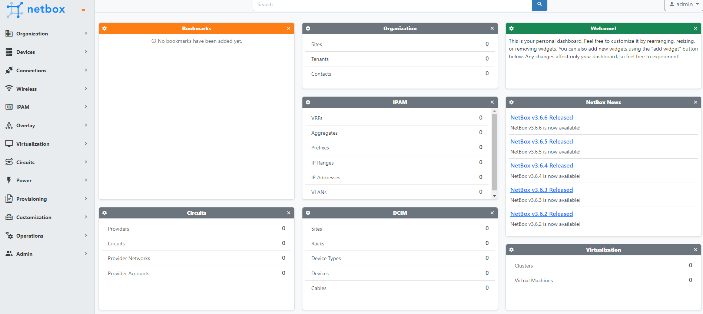
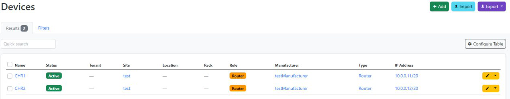
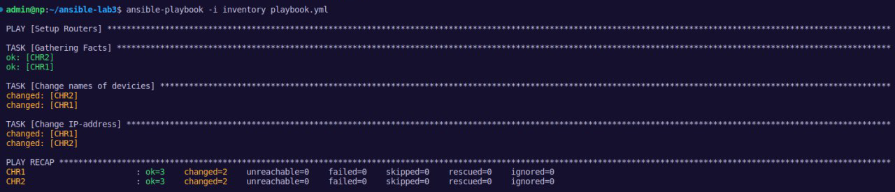
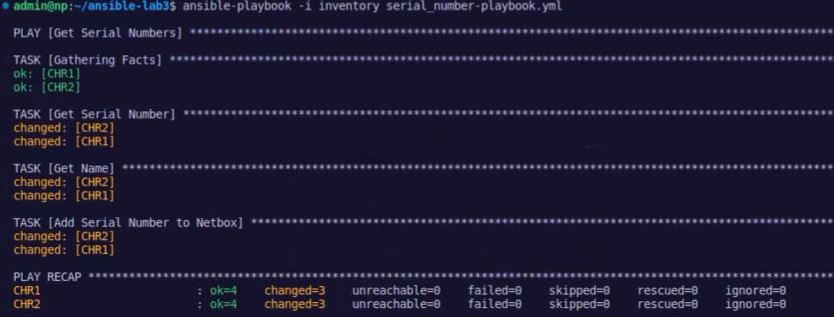
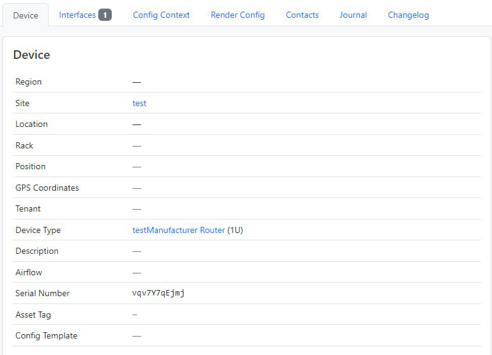
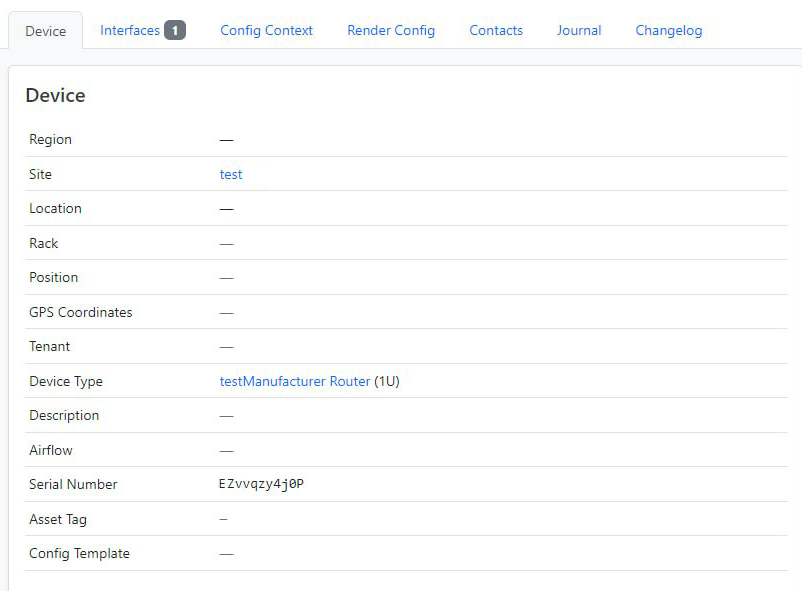
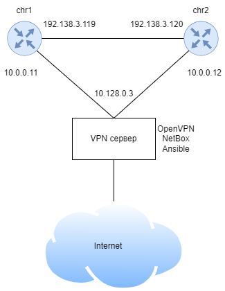

University: [ITMO University](https://itmo.ru/ru/)

Faculty: [FICT](https://fict.itmo.ru)

Course: [Network programming](https://github.com/itmo-ict-faculty/network-programming)

Year: 2023/2024

Group: K34212

Author: Sobolevskaya Nadezhda Sergeevna

Lab: Lab3

Date of create: 03.12.2023

Date of finished: 06.12.2023

# Отчет по лабораторной работе №3: "Развертывание Netbox, сеть связи как источник правды в системе технического учета Netbox"

## Цель работы

С помощью Ansible и Netbox собрать всю возможную информацию об устройствах и сохранить их в отдельном файле.

## Ход работы


#### 1. Поднимем Netbox на виртуальной машине в YandexCloud

Настроим базу данных PostrgreSQL, Redis, Python.

##### 1.1. Установка PostrgreSQL
```console
sudo apt install -y postgresql
```

Создаем базу данных и настраиваем пользователя
```console
CREATE DATABASE netbox;
CREATE USER netbox WITH PASSWORD 'password';
ALTER DATABASE netbox OWNER TO netbox;
```

##### 1.2. Установка Redis
```console
sudo apt install -y redis-server
```

##### 1.3. Установка Python
```console
sudo apt install python3 python3-pip python3-venv python3-dev build-essential libxml2-dev libxslt1-dev libffi-dev libpq-dev libssl-dev zlib1g-dev git -y
```

##### 1.4. Создание директории для клонирования ветки из репозитория NetBox
```console
sudo mkdir -p /opt/netbox/
cd /opt/netbox/
sudo git clone -b master --depth 1 https://github.com/netbox-community/netbox.git .
```

##### 1.5. Создание системного пользователя netbox и настройка его прав
```console
sudo adduser --system --group netbox
sudo chown --recursive netbox /opt/netbox/netbox/media/
sudo chown --recursive netbox /opt/netbox/netbox/reports/
sudo chown --recursive netbox /opt/netbox/netbox/scripts/
```

##### 1.6. Создание конфигурационного файла
Конфигурационный файл - копия cnfiguratiom_example.py для хранения локальных параметров конфигурации.

```console
cd /opt/netbox/netbox/netbox/
sudo cp configuration_example.py configuration.py
```
В этом файле прописываем список хостов (ALLOWED_HOSTS), параметры базы данных (имя пользователя, пароль), параметры Redis, случайно сгенерированный ключ (SECRET_KEY).

Генерация секретного ключа:
```console
python3 ../generate_secret_key.py
```

Файл имеет следующий вид:

```console
ALLOWED_HOSTS = ['*']
DATABASE = {
   'NAME': 'netbox',               # Database name
   'USER': 'netbox',               # PostgreSQL username
   'PASSWORD': 'password',           # PostgreSQL password
   'HOST': 'localhost',            # Database server
   'PORT': '',                     # Database port (leave blank for default)
   'CONN_MAX_AGE': 300,            # Max database connection age (seconds)
}

SECRET_KEY = 'секретный ключ'
```

##### 1.7. Запуск сценарий обновелния
```console
sudo /opt/netbox/upgrade.sh
```

##### 1.8. Создание суперпользователя
```console
source /opt/netbox/venv/bin/activate
cd /opt/netbox/netbox
python3 manage.py createsuperuser
```

##### 1.9. Запуск NetBox
```console
python3 manage.py runserver 0.0.0.0:8000 --insecure
```

Теперь веб-интерфейс нетбокса доступен по http://публичный_IP_сервера:8000. Заходим под ранее созданной учетной записью.




#### 2. Заполним информацию о CHR в Netbox

Добавим информацию о CHR. Создадим 2 роутера. Добавим интерфейсы для роутеров, затем на каждый интерфейс назначим ip-адреса, далее назначим ip роутерам.



#### 3. Сохраним данные из Netbox в файл с помощью Ansible

Установим модуль netbox для Ansible:

```console
ansible-galaxy collection install netbox.netbox
```

Создадим файл netbox_cinf_galaxy.yml:

```console
plugin: netbox.netbox.nb_inventory
api_endpoint: http://127.0.0.1:8000
token: токен
validate_certs: True
config_context: False
interfaces: True
```

В нём используем API токен, созданый в NetBox.

Сохраняем вывод скрипта в [файл](nb_inventory_old.yml) командой:

```console
ansible-inventory -v --list -y -i netbox_inventory.yml > nb_inventory.yml
```

#### 4. Настроим два CHR по сценарию

Напишем сценарий, при котором на основе данных из Netbox можно настроить 2 CHR, изменить имя устройства, добавить IP адрес на устройство.

Отредактируем [inventory-файл](nb_inventory.yml), перенесём переменные для подключения к роутерам:

```console
  vars:
    ansible_connection: ansible.netcommon.network_cli
    ansible_network_os: community.routeros.routeros
    ansible_user: admin
    ansible_ssh_pass: admin
```
Для изменения имени устройств и добавления IP-адресов напишем [сценарий](playbook.yml):
```console
- name: Setup Routers
  hosts: ungrouped
  tasks:
    - name: "Change devices names"
      community.routeros.command:
        commands:
          - /system identity set name="{{ interfaces[0].device.name }}"

    - name: "Change IP-address"
      community.routeros.command:
        commands:
          - /ip address add address="{{ interfaces[0].ip_addresses[0].address }}" interface="{{ interfaces[0].display }}"
```

Запустим playbook:

```console
ansible-playbook -i inventory playbook.yml
```




#### 5. Напишем сценарий для сбора серийного номера устройства и его вноса в NetBox

Напишем [сценарий](serial_number-playbook.yml), который вносит серийный номер устройства в NetBox.

Выполним сценарий:

```console
ansible-playbook -i inventory serial_number-playbook.yml
```
Получаем результат, видим измененные серийные номера:







Схема связи можно увидеть ниже:



#### 9. Вывод
В результате выполнения данной лабораторной работы удалось с помощью Ansible и Netbox собрать всю возможную информацию об устройствах и сохранить их в отдельном файле.
