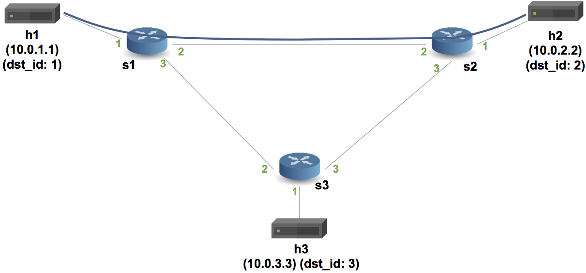

University: [ITMO University](https://itmo.ru/ru/)

Faculty: [FICT](https://fict.itmo.ru)

Course: [Network programming](https://github.com/itmo-ict-faculty/network-programming)

Year: 2023/2024

Group: K34212

Author: Sobolevskaya Nadezhda Sergeevna

Lab: Lab4

Date of create: 05.12.2023

Date of finished: 06.12.2023

# Отчет по лабораторной работе №4: "Базовая 'коммутация' и туннелирование используя язык программирования P4"

## Цель работы

Изучить синтаксис языка программирования P4 и выполнить 2 обучающих задания от Open network foundation для ознакомления на практике с P4.

## Ход работы

```console
sudo git clone https://github.com/p4lang/tutorials
```
Установим Vagrant. Перейдем в папку vm-ubuntu-20.04. Используя Vagrant, развернем тестовую среду: ```vagrant up```. В результате установки на VirtualBox появляется виртуальная машина с аккаунтами vagrant и p4.


#### 1. Implementing Basic Forwarding

На виртуальной машине выполняем вход под аккаунтом p4.

Используем следующую топологию сети:


Переходим в каталог tutorials/exercices/basic. Поднимаем виртуальную сеть Mininet, компилируем basic.p4, выполняем команду:

```console
make run
```

Проверим связность между хостами:


Пинг не успешен, так как все коммутаторы запрограммированы в соответствии с basic.p4 и по умолчанию отбрасывают все приходящие к ним пакеты.

Выйдем из mininet, остановим и очистим логи:
```console
exit
make stop
make clean
```

Внесем изменения в файл basic.p4, в нём необходимо дописать функции MyParser, MyIngress и MyDeparser.
Обновляем парсер, который позволяет заполнять заголовки ethernet_t, ipv4_t.

```console
parser MyParser(packet_in packet,
                out headers hdr,
                inout metadata meta,
                inout standard_metadata_t standard_metadata) {

    state start {
        /* TODO: add parser logic */
        transition parse_ethernet;
        #transition accept;
    }

    state parse_ethernet {
        packet.extract(hdr.ethernet);
        transition select(hdr.ethernet.etherType) {
            TYPE_IPV4 : parse_ipv4;
            default : accept;
        }
    }

    state parse_ipv4 {
        packet.extract(hdr.ipv4);
        transition accept;
    }
}
```

Далее напишем действие ip4_forward: добавляем определение выходного порта, обновление адреса назначения и источника отправления пакета, а также уменьшаем значение TTL:

```console
action ipv4_forward(macAddr_t dstAddr, egressSpec_t port) {
        /* TODO: fill out code in action body */
        standard_metadata.egress_spec = port;
        hdr.ethernet.srcAddr = hdr.ethernet.dstAddr;
        hdr.ethernet.dstAddr = dstAddr;
        hdr.ipv4.ttl = hdr.ipv4.ttl - 1;
    }
```

Обеспечиваем применение ipv4_lpm при наличии валидного заголовка ipv4:

```console
apply {
        /* TODO: fix ingress control logic
         *  - ipv4_lpm should be applied only when IPv4 header is valid
         */
        if (hdr.ipv4.isValid()) {
            ipv4_lpm.apply();
        }
    }
```

Получившийся файл: [basic.p4](basic.p4)

Теперь еще раз выполняем команду:
```console
make run
```

Пробуем выполнить пинг:


#### 2. Implementing Basic Tunneling

Необходимо получить следующую топологию сети:



Для выполнения работы открываем папку p4\tutorials\exercises\basic_tunneling, в ней редактируем файл basic_tunneling.p4.

Добавляем парсер parse_myTunnel, который извлекает информацию из заголовка myTunnel. Если значение поля proto_id равно 0x800, то происходит переход к парсеру parse_ipv4.

```console
    state parse_ethernet {
        packet.extract(hdr.ethernet);
        transition select(hdr.ethernet.etherType) {
            TYPE_IPV4 : parse_ipv4;
            TYPE_MYTUNNEL : parse_myTunnel;
            default : accept;
        }
    }
```

Адаптируем парсер parse_ethernet так, чтобы в зависимости от значения поля etherType извлекать либо заголовок ipv4, либо myTunnel.

```console
    state parse_myTunnel {
        packet.extract(hdr.myTunnel);
        transition select(hdr.myTunnel.proto_id) {
            TYPE_IPV4 : parse_ipv4;
            default : accept;
        }
    }
```

Определяем таблицу myTunnel_exact, ответственную за маршрутизацию пакетов myTunnel.

```console
    #// TODO: declare a new action: myTunnel_forward(egressSpec_t port)
    action myTunnel_forward(egressSpec_t port) {
        standard_metadata.egress_spec = port;
    }
    #// TODO: declare a new table: myTunnel_exact
    #// TODO: also remember to add table entries!
    table myTunnel_exact {
        key = {
            hdr.myTunnel.dst_id: exact;
        }
        actions = {
            myTunnel_forward;
            drop;
            NoAction;
        }
        size = 1024;
        default_action = NoAction();
    }
    apply {
        #// TODO: Update control flow
        if (hdr.ipv4.isValid() && !hdr.myTunnel.isValid()) {
            ipv4_lpm.apply();
        }
        if (hdr.myTunnel.isValid()) {
            myTunnel_exact.apply();
        }
    }
```

Напишем также депарсер:

```console
control MyDeparser(packet_out packet, in headers hdr) {
    apply {
        packet.emit(hdr.ethernet);
        #// TODO: emit myTunnel header as well
        packet.emit(hdr.myTunnel);
        packet.emit(hdr.ipv4);
    }
}
```

Получившийся файл: [basic_tunnel.p4](basic_tunnel.p4)

Проверим работу скрипта, запустим mininet, затем откроем два терминала для h1 и h2:

```console
xterm h1 h2
```

Отправляем пакет с h1 на h2 без туннелирования. Видим, что пакет с переданным сообщением доходит до адресата:


Теперь используем туннелирование, в xterm узла h1 отправим сообщение на h2 с указанием ID назначения.  Видно, что пакет так же получен на узле h2:


Теперь изменим IP-адрес назначения при отправке сообщения с узла h1, но оставим ID назначения = 2 (h2). Пакет все равно получен на узле h2:


## Вывод
В результате выполнения данной лабораторной работы удалось изучить синтаксис языка программирования P4 и выполнить 2 обучающих задания от Open network foundation для ознакомления на практике с P4.